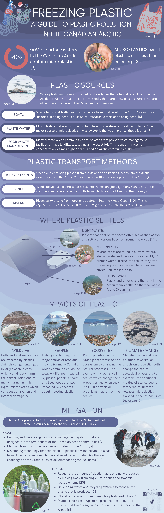
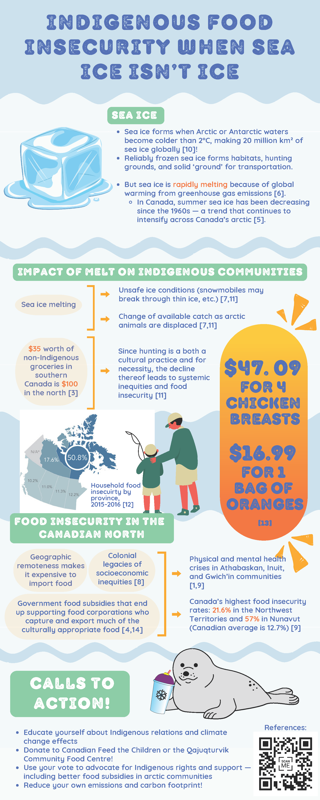
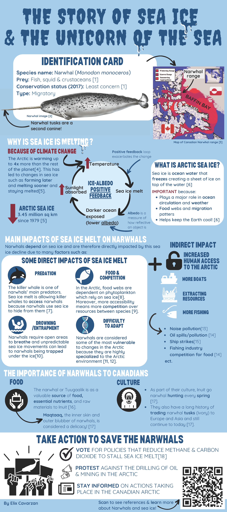
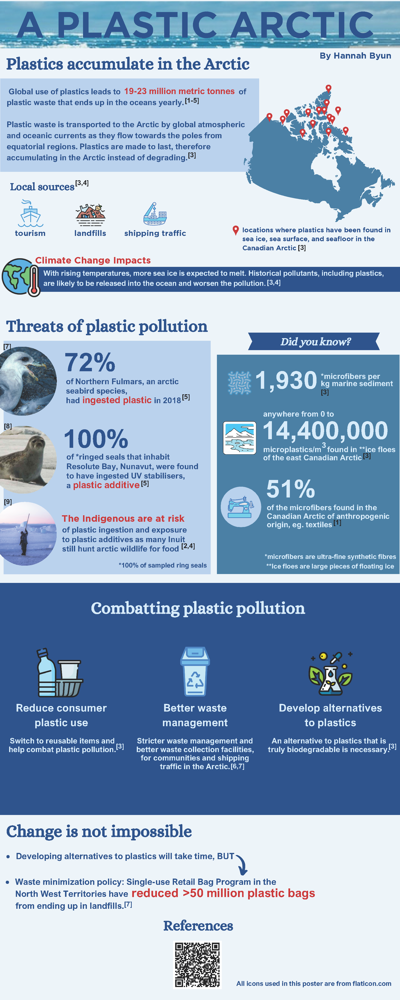
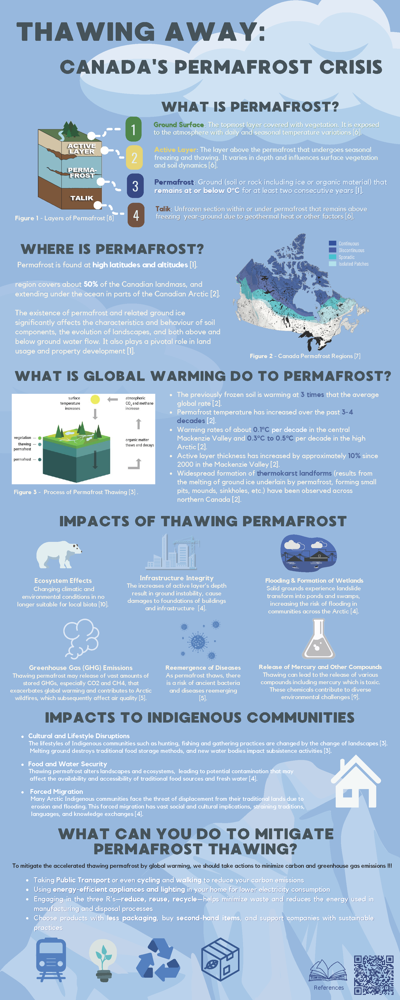
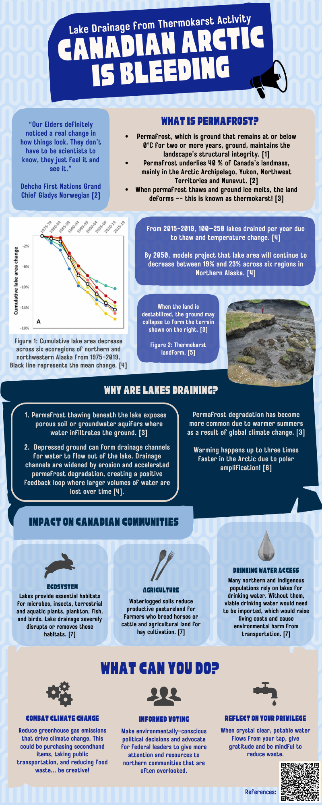
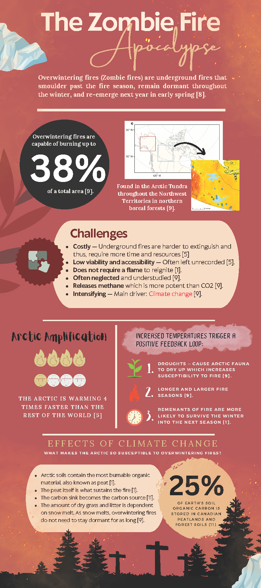
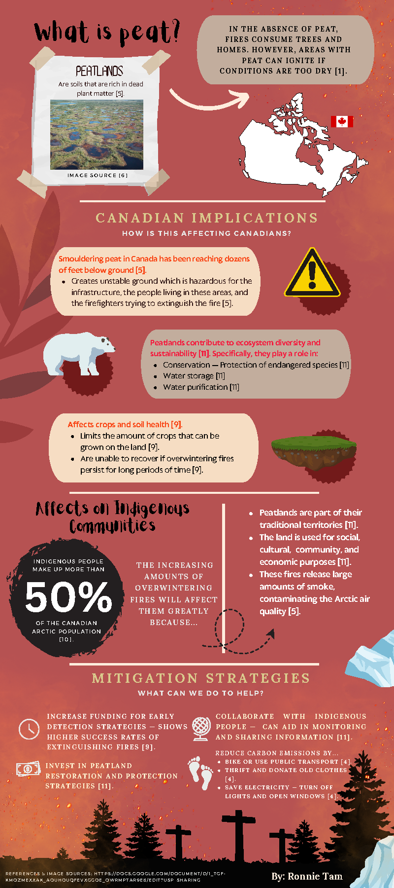

## Introduction

This is a collaboration between the Map & Data Library and Dr. Sarah Peirce to showcase top student infographics assignments in GGR308. Read our [project page](https://library.utoronto.ca/project/map-and-data-library-infographics-showcases) to learn more about this initiative.

## Selected infographics

Note: The following 7 infographics were created in GGR308 - Canadian Arctic and Subarctic Environments (Fall 2023). The University of Toronto Libraries has received permission from the creators of these infographics to share them on this site. If you are concerned that you have found material within this collection of infographics that you believe should be removed, please [contact us](https://mdl.library.utoronto.ca/about/contact), and we will respond to your inquiry as soon as possible.

**Click on an infographic to view the full, zoomable image.**

<table class="table" style="width:500px;" border="0.5" cellpadding="10" cellspacing="10">
    <tbody>
        <tr>
            <td style="text-align:center;vertical-align:top;">
                

                    
                

                

                    <a href="assets/images/FreezingPlasticReferences.pdf">References</a>
                

            </td>
            <td style="text-align:center;vertical-align:top;">
                

                    
                

                

                    <a href="assets/images/IndigenousFoodInsecurityReferences.pdf">References</a>
                

            </td>
        </tr>
        <tr>
            <td style="text-align:center;vertical-align:top;">
                

                    
                

                

                    <a href="assets/images/NarwhalReferences.pdf">References</a>
                

            </td>
            <td style="text-align:center;vertical-align:top;">
                

                    
                

                

                    <a href="assets/images/PlasticArcticReferences.pdf">References</a>
                

            </td>
        </tr>
        <tr>
            <td style="text-align:center;vertical-align:top;">
                

                    
                

                

                    <a href="assets/images/ThawingAwayReferences.pdf">References</a>
                

            </td>
            <td style="text-align:center;vertical-align:top;">
                

                    
                

                

                    <a href="assets/images/ThermokarstReferences.pdf">References</a>
                

            </td>
        </tr>
        <tr>
            <td style="text-align:center;vertical-align:top;">
                
            </td>
            <td style="text-align:center;vertical-align:top;">
                
            </td>
        </tr>
        <tr>
            <td style="text-align:center;vertical-align:top;" colspan="2">
                <a href="assets/images/ZombieFireReferences.pdf">References</a>
            </td>
        </tr>
    </tbody>
</table>